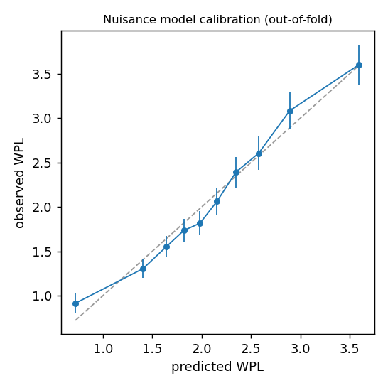
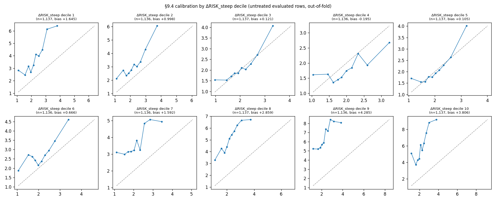
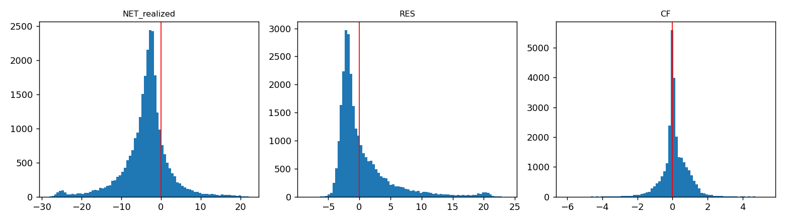
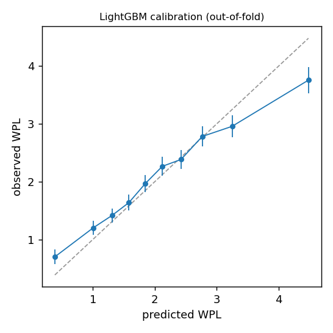
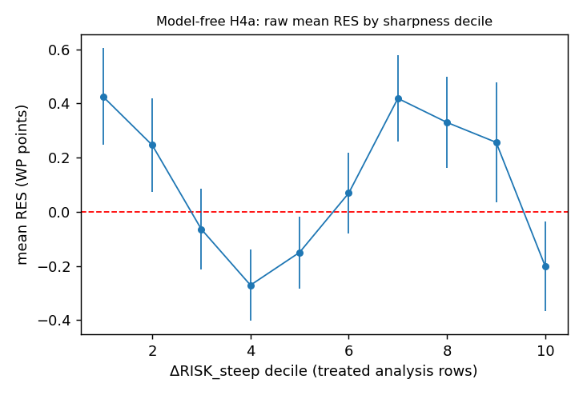

# Paper 4 SPEC v3 — counterfactual test of opponent error

_Generated 2026-09-06 01:42. SPEC v3 (LOCKED 2026-09-05) + Amendment 1._


## 1. Environment and measured cost

| item          | value                                                       | note                                                      |
|---------------|-------------------------------------------------------------|-----------------------------------------------------------|
| engine        | Stockfish 18 by the Stockfish developers (see AUTHORS file) |                                                           |
| configuration | depth 15, MultiPV 5, Threads=1, Hash=128 MB                 | [LOCKED]                                                  |
| python        | 3.9.6                                                       | README asks 3.10+; 3.9.6 is what ran (Amendment 1 item 6) |
| platform      | Darwin arm64                                                | 10 cores                                                  |
| statsmodels   | 0.14.6                                                      |                                                           |

**successor re-evaluation (57,294 positions)** — `p4_v3_successor.log`:

```
2026-09-06 01:05:33,328 - 54000/57294  6 pos/s  eta 9 min
2026-09-06 01:11:37,706 - 56000/57294  6 pos/s  eta 3 min
2026-09-06 01:16:05,889 - done: 57294 positions in 155.1 min (1299 ms/pos wall, 8 procs)
```


**opponent-reply evaluation** — `p4_v3_rows.log`:

```
2026-09-06 01:23:38,632 - 2000/5726  5 pos/s  eta 12 min
2026-09-06 01:30:56,757 - 4000/5726  5 pos/s  eta 6 min
2026-09-06 01:36:59,980 - reply evals: 5726 in 20.0 min
```


### Consistency of the re-evaluation with v2 (Amendment 1 item 2) [LOCKED]


```
v2 rows 57294 | recomputed rows 57294
coverage: matched 57294, unmatched 0

risk_steep:  max |diff| = 0.000e+00   exact mismatches = 0 / 57294
    |diff| >   1e-12 : 0
    |diff| >   1e-09 : 0
    |diff| >   1e-06 : 0
    |diff| >   1e-03 : 0

wp_self_opp_best:  max |diff| = 0.000e+00   exact mismatches = 0 / 57294
    |diff| >   1e-12 : 0
    |diff| >   1e-09 : 0
    |diff| >   1e-06 : 0
    |diff| >   1e-03 : 0

wp_self_opp_worst:  max |diff| = 0.000e+00   exact mismatches = 0 / 57294
    |diff| >   1e-12 : 0
    |diff| >   1e-09 : 0
    |diff| >   1e-06 : 0
    |diff| >   1e-03 : 0

n_pv:  max |diff| = 0.000e+00   exact mismatches = 0 / 57294
    |diff| >   1e-12 : 0
    |diff| >   1e-09 : 0
    |diff| >   1e-06 : 0
    |diff| >   1e-03 : 0

=== VERDICT: risk_steep mismatches = 0, max |diff| = 0.000e+00 ===
PASS — recomputation reproduces v2 exactly. Proceeding is permitted.
```


The 57,294 successor positions were re-evaluated only to recover the five MultiPV lines v2 did not persist. `ΔRISK_steep` continues to come from v2's stored values (§3.3); the recomputed values are used for nothing but this check.


## 2. Data coverage

| quantity                               | count  | share          |
|----------------------------------------|--------|----------------|
| deviation rows (v1 m_played != m_best) | 28,647 | 100.00%        |
| with an opponent reply (kept)          | 28,603 | 99.85%         |
| discarded                              | 44     | 0.15%          |
|   - game_ended_no_reply                | 44     | 0.15%          |
| reply inside P(m_played) MultiPV-5     | 22,877 | 79.98% of kept |
| reply needing a fresh evaluation       | 5,726  | 20.02% of kept |

**Discard rate by ΔRISK_steep quartile** [LOCKED §9.2] — discarding is post-treatment, so a gradient here would mean H2/H4 carry selection bias.

| ΔRISK_steep quartile | n     | discarded | rate  |
|----------------------|-------|-----------|-------|
| Q1 (least sharp)     | 7,162 | 11        | 0.15% |
| Q2                   | 7,162 | 11        | 0.15% |
| Q3                   | 7,161 | 12        | 0.17% |
| Q4 (sharpest)        | 7,162 | 10        | 0.14% |

χ²(3) = 0.18, p = 0.9804.

| quantity                                               | count  | share   |
|--------------------------------------------------------|--------|---------|
| all evaluated v1 rows                                  | 50,021 | 100.00% |
| previous ply not evaluated (v1 30-ply sampling gap)    | 1,970  | 3.94%   |
| main training set (previous ply = engine first choice) | 20,387 | 40.76%  |
| games with no %clk (excluded whole-game, §3.2)         | 0      | 0.00%   |

## 4. Expected-error model (§4)

```
WPL ~ wp_level_z + wp_level_z2 + gap_12_z + spread_15_z + n_legal_z + n_reasonable_z + eval_volatility_z + elo_z + time_pressure_z + (1 | player_id)
```

**Fold-1 linear mixed model (all five folds in the appendix figure)**

Continuous predictors standardised on the main training set; those parameters are reused unchanged at prediction time. **Random effects:** a single grouping factor, `(1 | player_id)`, fitted exactly by `MixedLM` — the nesting approximation of Amendment 2 item 1 does not apply here (item 3).

| term              | coef (std.) | 95% CI             | p        |     |
|-------------------|-------------|--------------------|----------|-----|
| Intercept         | +2.2410     | [+2.1687, +2.3134] | 0        | *** |
| wp_level_z        | +0.2527     | [+0.1860, +0.3194] | 1.11e-13 | *** |
| wp_level_z2       | -0.1387     | [-0.1732, -0.1043] | 2.97e-15 | *** |
| gap_12_z          | -0.1805     | [-0.2612, -0.0998] | 1.16e-05 | *** |
| spread_15_z       | -0.6560     | [-0.7556, -0.5564] | 4.08e-38 | *** |
| n_legal_z         | +0.1517     | [+0.0914, +0.2119] | 8.1e-07  | *** |
| n_reasonable_z    | -0.6488     | [-0.7384, -0.5591] | 1.09e-45 | *** |
| eval_volatility_z | +0.2251     | [+0.1638, +0.2864] | 6.26e-13 | *** |
| elo_z             | -0.3183     | [-0.3810, -0.2557] | 2.15e-23 | *** |
| time_pressure_z   | -0.4406     | [-0.5025, -0.3788] | 2.82e-44 | *** |
- random-effect variance `Group Var` = 0.0220

- N = 16315


**Out-of-sample R² per fold**: 0.0308, 0.0449, 0.0433, 0.0420, 0.0488  (mean 0.0419)


Predictions use the fixed-effect part only. The two branches share the same opponent, so a player random intercept would cancel in `CF = E_played − E_best` regardless.




| bin | n     | mean predicted | mean observed | obs − pred |
|-----|-------|----------------|---------------|------------|
| 0   | 2,039 | 0.722          | 0.915         | +0.193     |
| 1   | 2,039 | 1.406          | 1.304         | -0.101     |
| 2   | 2,038 | 1.641          | 1.550         | -0.091     |
| 3   | 2,039 | 1.819          | 1.735         | -0.085     |
| 4   | 2,039 | 1.983          | 1.817         | -0.167     |
| 5   | 2,038 | 2.156          | 2.064         | -0.092     |
| 6   | 2,039 | 2.348          | 2.392         | +0.044     |
| 7   | 2,038 | 2.576          | 2.603         | +0.026     |
| 8   | 2,039 | 2.891          | 3.082         | +0.191     |
| 9   | 2,039 | 3.596          | 3.603         | +0.007     |




_Reading of "untreated evaluated rows" here: the §4.1 main training set (rows whose previous ply was the engine's first choice), restricted to those rows that are themselves deviations and therefore have a defined ΔRISK_steep. Predictions are out-of-fold. A systematic negative mean (obs − pred) in the top deciles would mean the linear model under-predicts expected error exactly where sharpness is highest, which would leak difficulty into `RES` and make H4 read false-positive; in that case §7.3 governs._

| ΔRISK_steep decile | n     | mean ΔRISK_steep | linear §4.2: mean (obs − pred) | LightGBM §7.3: mean (obs − pred) |
|--------------------|-------|------------------|--------------------------------|----------------------------------|
| 1                  | 1,137 | -22.326          | +1.6454                        | +1.5429                          |
| 2                  | 1,136 | -3.822           | +0.9978                        | +0.9429                          |
| 3                  | 1,137 | -1.012           | +0.1213                        | +0.2252                          |
| 4                  | 1,136 | +0.028           | -0.1947                        | +0.0137                          |
| 5                  | 1,137 | +0.854           | +0.1053                        | +0.2881                          |
| 6                  | 1,136 | +1.902           | +0.6658                        | +0.6955                          |
| 7                  | 1,136 | +3.531           | +1.5919                        | +1.5427                          |
| 8                  | 1,137 | +6.514           | +2.8585                        | +2.7356                          |
| 9                  | 1,136 | +13.779          | +4.2853                        | +4.1743                          |
| 10                 | 1,137 | +33.083          | +3.8058                        | +3.7135                          |

**§9.4 verdict.** The bias is systematic and large: mean (obs − pred) runs from -0.19 to +4.29 WP points across deciles and rises monotonically from decile 4 upward. §9.4 says that when this plot shows systematic bias the interpretation of H4 defers to §7 item 3 (LightGBM). **It does not help**: the same diagnostic on the LightGBM fit gives an almost identical profile (last column). The bias is therefore not a linear-specification artefact.


The reason is structural rather than a modelling defect. The nuisance model predicts a move's error from features of the **position**; ΔRISK_steep is a property of the **move chosen**, which no position feature observes. Rows where the player picked something far from the engine's choice in either direction carry larger error than any position-only model can anticipate — note deciles 1 and 2, where ΔRISK_steep is strongly *negative*, are biased upward too. The profile is U-shaped in |ΔRISK_steep|, not increasing in sharpness.


**What this does to H4, stated carefully.** The bias runs in the direction §9.4 feared: under-predicted error at high sharpness inflates `RES = WPL_opp_actual − E_played` exactly where ΔRISK_steep is large, which pushes the `RES` coefficient **upward**. The estimated coefficient is **negative**. A bias that can only push a coefficient up cannot manufacture a negative estimate, so the H4 finding below is conservative with respect to this defect: the true coefficient is, if anything, more negative. This guard was designed to catch a false *positive*, and no positive result is being claimed.


**Prediction coverage.** 27,467 of 28,603 kept rows receive both branch predictions; 1,136 (3.97%) do not, because at least one branch feature is missing — almost entirely `eval_volatility`, which needs ply−1 to have been evaluated and so inherits v1's 30-moves-per-game sampling gap. Those rows drop out of every §6 model.


## 5. Distributions of NET_realized, RES and CF (§9.5)

| variable     | mean    | sd     | p1      | p5      | p25    | p50    | p75    | p95     | p99     |
|--------------|---------|--------|---------|---------|--------|--------|--------|---------|---------|
| NET_realized | -3.6611 | 5.9146 | -24.466 | -14.149 | -5.838 | -3.083 | -1.149 | +4.873  | +13.451 |
| RES          | +0.5187 | 4.5050 | -4.035  | -3.285  | -2.155 | -1.121 | +1.596 | +10.081 | +19.837 |
| CF           | +0.1184 | 0.7395 | -2.106  | -1.036  | -0.144 | +0.043 | +0.463 | +1.299  | +2.131  |
| NET_expected | -4.1723 | 4.7799 | -22.653 | -14.416 | -5.519 | -2.605 | -0.984 | -0.038  | +0.648  |

**Pairwise correlations**

|              | NET_realized | RES    | CF     |
|--------------|--------------|--------|--------|
| NET_realized | +1.000       | +0.608 | +0.034 |
| RES          | +0.608       | +1.000 | +0.024 |
| CF           | +0.034       | +0.024 | +1.000 |




## 3. Required explicit tests


**§3.1 non-negativity**, 200 random rows: `WPL_opp_actual_raw >= 0` holds for **199/200**.


Across all 28,603 kept rows: 21 negative (0.07%), most negative -3.8866 WP.


Negatives by reply source — inside MultiPV-5: 0; freshly evaluated: 21. A reply that sits inside the stored MultiPV-5 cannot be negative by construction; a freshly evaluated reply can, because that search starts one ply deeper than the MultiPV-5 lines it is compared against. This is the depth asymmetry the two-tier rule in §3.1 creates, reported rather than clamped.


**Mirror test (v1 perspective flip, re-run).** On P(m_played) of the first analysis row: WP from the opponent's POV 45.1367, WP_self 54.8633, sum 100.000000 (must be 100). PASS


### Sign test — 10 random deviation rows (§9.3)


**120935983555 ply 18** (white to move, Elo 2636 vs 2849)

- FEN `r1bqkb1r/3p1ppp/2p2n2/p3p3/Pp2P3/1BN2Q2/1PPP1PPP/R1B2RK1 w kq - 0 10`
- m_played `Ne2`, m_best `d4`, WPL_self 8.320
- opponent reply `d7d6` (outside P(m_played) MultiPV-5)
- P(m_played): opponent first choice WP_self 49.816 (= WP_opp 50.184); P(m_best): WP_self 56.680 (= WP_opp 43.320)
- WPL_opp_actual 7.135 | E_played 2.273 | E_best 1.286
- CF +0.988 | RES +4.861 | **NET_realized -2.471**

**168879574004 ply 32** (white to move, Elo 2661 vs 2685)

- FEN `2r2rk1/1bqn1ppp/p2ppbP1/np5P/3NPP2/P1N1B3/1PPQ4/1K1R1B1R w - - 1 17`
- m_played `gxf7+`, m_best `h6`, WPL_self 9.790
- opponent reply `g8f7` (inside P(m_played) MultiPV-5)
- P(m_played): opponent first choice WP_self 62.868 (= WP_opp 37.132); P(m_best): WP_self 72.626 (= WP_opp 27.374)
- WPL_opp_actual 8.946 | E_played 1.904 | E_best 1.396
- CF +0.508 | RES +7.042 | **NET_realized -2.240**

**169186053582 ply 29** (black to move, Elo 2329 vs 2313)

- FEN `r2qk2r/1b1nbppp/4p3/p2nP1B1/PpBp3P/5N2/1P1NQPP1/R4RK1 b kq - 1 15`
- m_played `N7b6`, m_best `Bxg5`, WPL_self 17.297
- opponent reply `c4d3` (outside P(m_played) MultiPV-5)
- P(m_played): opponent first choice WP_self 41.076 (= WP_opp 58.924); P(m_best): WP_self 62.523 (= WP_opp 37.477)
- WPL_opp_actual 8.832 | E_played 3.559 | E_best 1.935
- CF +1.624 | RES +5.274 | **NET_realized -10.400**

**168652965592 ply 30** (white to move, Elo 2713 vs 2690)

- FEN `N1b2b1r/pp2kppp/4p3/2p5/2pn4/6P1/PP3PBP/R2R1K2 w - - 2 16`
- m_played `Rac1`, m_best `Nc7`, WPL_self 1.324
- opponent reply `b7b5` (inside P(m_played) MultiPV-5)
- P(m_played): opponent first choice WP_self 33.600 (= WP_opp 66.400); P(m_best): WP_self 36.107 (= WP_opp 63.893)
- WPL_opp_actual 0.743 | E_played 1.927 | E_best 1.747
- CF +0.180 | RES -1.184 | **NET_realized -2.327**

**168905090038 ply 32** (white to move, Elo 2824 vs 2811)

- FEN `qr4k1/3bbppp/3p4/4p1Pn/4P3/1NN1BP2/1PPQ3P/4K2R w K - 0 17`
- m_played `Nd5`, m_best `O-O`, WPL_self 0.539
- opponent reply `e7d8` (inside P(m_played) MultiPV-5)
- P(m_played): opponent first choice WP_self 56.860 (= WP_opp 43.140); P(m_best): WP_self 57.581 (= WP_opp 42.419)
- WPL_opp_actual 0.000 | E_played 1.930 | E_best 1.768
- CF +0.162 | RES -1.930 | **NET_realized -2.308**

**169324685924 ply 18** (white to move, Elo 2820 vs 2765)

- FEN `r2q1rk1/pbpnbppp/1p3n2/3p4/P2P4/2NBPN2/1P3PPP/R1BQ1RK1 w - - 1 10`
- m_played `a5`, m_best `b3`, WPL_self 0.092
- opponent reply `c7c5` (inside P(m_played) MultiPV-5)
- P(m_played): opponent first choice WP_self 52.208 (= WP_opp 47.792); P(m_best): WP_self 50.644 (= WP_opp 49.356)
- WPL_opp_actual 2.656 | E_played 1.719 | E_best 1.530
- CF +0.189 | RES +0.937 | **NET_realized +1.033**

**137198947956 ply 31** (black to move, Elo 2793 vs 2744)

- FEN `r1r3k1/p1nqbppp/1p1ppn2/8/3PP3/P4N1P/1P1NQPPB/2R2RK1 b - - 2 16`
- m_played `h6`, m_best `Nce8`, WPL_self 1.012
- opponent reply `c1c2` (outside P(m_played) MultiPV-5)
- P(m_played): opponent first choice WP_self 49.264 (= WP_opp 50.736); P(m_best): WP_self 48.620 (= WP_opp 51.380)
- WPL_opp_actual 1.381 | E_played 2.183 | E_best 2.150
- CF +0.033 | RES -0.802 | **NET_realized -1.781**

**24501748095 ply 26** (white to move, Elo 2445 vs 2442)

- FEN `r1bqr1k1/1ppn1pb1/6pp/p3p3/8/2N1QNPB/PPP1PP1P/R2R2K1 w - - 3 14`
- m_played `Rd2`, m_best `Nb5`, WPL_self 2.759
- opponent reply `f7f5` (inside P(m_played) MultiPV-5)
- P(m_played): opponent first choice WP_self 50.000 (= WP_opp 50.000); P(m_best): WP_self 54.407 (= WP_opp 45.593)
- WPL_opp_actual 12.523 | E_played 2.578 | E_best 2.301
- CF +0.277 | RES +9.945 | **NET_realized +7.463**

**113064055451 ply 21** (black to move, Elo 2191 vs 2234)

- FEN `r1bqk1nr/pp1n3p/2p3p1/2b3N1/3pP3/7Q/PPP3PP/RNB2RK1 b - - 1 11`
- m_played `Ne5`, m_best `Qe7`, WPL_self 2.417
- opponent reply `h3b3` (inside P(m_played) MultiPV-5)
- P(m_played): opponent first choice WP_self 73.424 (= WP_opp 26.576); P(m_best): WP_self 69.914 (= WP_opp 30.086)
- WPL_opp_actual 6.010 | E_played 2.811 | E_best 2.635
- CF +0.176 | RES +3.200 | **NET_realized +0.958**

**37445409191 ply 37** (black to move, Elo 2545 vs 2488)

- FEN `r3qr2/1p2n1bk/p2p1ppp/4p3/P1BpPPb1/1P1P2BP/2PQNRP1/5RK1 b - - 0 19`
- m_played `Bd7`, m_best `Bxe2`, WPL_self 0.092
- opponent reply `g3h4` (outside P(m_played) MultiPV-5)
- P(m_played): opponent first choice WP_self 47.333 (= WP_opp 52.667); P(m_best): WP_self 48.436 (= WP_opp 51.564)
- WPL_opp_actual 17.573 | E_played 3.090 | E_best 1.784
- CF +1.306 | RES +14.483 | **NET_realized +15.697**

## 6. Tests (§6)


Analysis rows: `WPL_self ∈ (0, 5]` → **19,812** of 28,603 kept rows (69.27%).


Median `WPL_self` in the band = **1.640** WP points (§6.1 pre-estimated ≈2; the ±50% stop rule is |median − 2| > 1, i.e. outside [1, 3]). 
Within tolerance; ±0.5 equivalence interval stands.


### 6.1 H1 — is deviating worth it on average


```
NET_realized ~ 1
```

**H1: intercept-only mixed model**

**Random effects:** the [LOCKED] `(1 | player_id) + (1 | game_id)` is estimated with `game_id` nested inside `player_id` (v1 `fit_mixed`, `paper4_report.py:74`; SPEC v3 Amendment 2 item 1). In the analysis band 98.5% of games contribute rows from both players, so the crossing is real; what the approximation drops is the shared game intercept across a game's two players. The OLS fit with player-clustered SEs below is the check on it.

| term      | coef (std.) | 95% CI             | p |     |
|-----------|-------------|--------------------|---|-----|
| Intercept | -1.7223     | [-1.7890, -1.6556] | 0 | *** |
- random-effect variance `game Var` = 0.1036

- N = 18903

**OLS, player-clustered SEs (robustness on the same rows)**


| term      | coef (std.) | 95% CI             | p |     |
|-----------|-------------|--------------------|---|-----|
| Intercept | -1.7625     | [-1.8209, -1.7040] | 0 | *** |

- N = 18903


**Intercept = -1.7223 WP points**, 95% CI [-1.7890, -1.6556].


**TOST** against ±0.5 WP points [LOCKED §6.1]: p(lower) = 1, p(upper) = 0, **overall p = 1** → NOT statistically equivalent to zero at α = .05.


**Asymmetry (§6.1, stated verbatim as required).** `NET_realized` uses an observed value on the actual branch and a model expectation on the counterfactual branch, so noise enters from one side only. Under the identification assumption this is unbiased, but the variance is inflated and the CI is correspondingly wide. That is a known cost of the design, not a defect.


### 6.2 H2 — does sharpness predict net gain


```
NET_realized ~ delta_risk_steep_z + WPL_self_z + gap_12_orig_z + eval_volatility_orig_z + time_pressure_opp_z + elo_diff_opp_z
```

**H2: net realised gain**

**Random effects:** the [LOCKED] `(1 | player_id) + (1 | game_id)` is estimated with `game_id` nested inside `player_id` (v1 `fit_mixed`, `paper4_report.py:74`; SPEC v3 Amendment 2 item 1). In the analysis band 98.5% of games contribute rows from both players, so the crossing is real; what the approximation drops is the shared game intercept across a game's two players. The OLS fit with player-clustered SEs below is the check on it.

| term                   | coef (std.) | 95% CI             | p         |     |
|------------------------|-------------|--------------------|-----------|-----|
| Intercept              | -1.7355     | [-1.7921, -1.6789] | 0         | *** |
| delta_risk_steep_z     | -0.4751     | [-0.5272, -0.4229] | 2.92e-71  | *** |
| WPL_self_z             | -1.1637     | [-1.2265, -1.1009] | 5.01e-289 | *** |
| gap_12_orig_z          | +0.0621     | [-0.0010, +0.1252] | 0.0538    |     |
| eval_volatility_orig_z | +0.2225     | [+0.1693, +0.2756] | 2.41e-16  | *** |
| time_pressure_opp_z    | +0.0361     | [-0.0190, +0.0912] | 0.199     |     |
| elo_diff_opp_z         | -0.0902     | [-0.1472, -0.0332] | 0.00192   | **  |
- random-effect variance `game Var` = 0.0347

- N = 18903

**OLS, player-clustered SEs (robustness on the same rows)**


| term                   | coef (std.) | 95% CI             | p         |     |
|------------------------|-------------|--------------------|-----------|-----|
| Intercept              | -1.7546     | [-1.8105, -1.6986] | 0         | *** |
| delta_risk_steep_z     | -0.4754     | [-0.5280, -0.4227] | 5.64e-70  | *** |
| WPL_self_z             | -1.1609     | [-1.2290, -1.0928] | 7.74e-245 | *** |
| gap_12_orig_z          | +0.0740     | [+0.0013, +0.1467] | 0.0459    | *   |
| eval_volatility_orig_z | +0.2488     | [+0.1739, +0.3237] | 7.4e-11   | *** |
| time_pressure_opp_z    | +0.0565     | [-0.0043, +0.1174] | 0.0686    |     |
| elo_diff_opp_z         | -0.0879     | [-0.1566, -0.0192] | 0.0121    | *   |

- N = 18903


### 6.3 H3 — conditions


```
NET_realized ~ delta_risk_steep_z + WPL_self_z + gap_12_orig_z + eval_volatility_orig_z + time_pressure_opp_z + elo_diff_opp_z + delta_risk_steep_z:time_pressure_opp_z + delta_risk_steep_z:elo_diff_opp_z
```

**H3: two pre-specified interactions**

**Random effects:** the [LOCKED] `(1 | player_id) + (1 | game_id)` is estimated with `game_id` nested inside `player_id` (v1 `fit_mixed`, `paper4_report.py:74`; SPEC v3 Amendment 2 item 1). In the analysis band 98.5% of games contribute rows from both players, so the crossing is real; what the approximation drops is the shared game intercept across a game's two players. The OLS fit with player-clustered SEs below is the check on it.

| term                                   | coef (std.) | 95% CI             | p         |     |
|----------------------------------------|-------------|--------------------|-----------|-----|
| Intercept                              | -1.7354     | [-1.7920, -1.6788] | 0         | *** |
| delta_risk_steep_z                     | -0.4733     | [-0.5260, -0.4207] | 2e-69     | *** |
| WPL_self_z                             | -1.1639     | [-1.2267, -1.1011] | 4.83e-289 | *** |
| gap_12_orig_z                          | +0.0621     | [-0.0010, +0.1252] | 0.0537    |     |
| eval_volatility_orig_z                 | +0.2229     | [+0.1697, +0.2760] | 2.2e-16   | *** |
| time_pressure_opp_z                    | +0.0365     | [-0.0187, +0.0916] | 0.195     |     |
| elo_diff_opp_z                         | -0.0899     | [-0.1471, -0.0327] | 0.00207   | **  |
| delta_risk_steep_z:time_pressure_opp_z | +0.0130     | [-0.0381, +0.0642] | 0.618     |     |
| delta_risk_steep_z:elo_diff_opp_z      | -0.0045     | [-0.0530, +0.0441] | 0.856     |     |
- random-effect variance `game Var` = 0.0347

- N = 18903

**OLS, player-clustered SEs (robustness on the same rows)**


| term                                   | coef (std.) | 95% CI             | p         |     |
|----------------------------------------|-------------|--------------------|-----------|-----|
| Intercept                              | -1.7544     | [-1.8104, -1.6984] | 0         | *** |
| delta_risk_steep_z                     | -0.4735     | [-0.5266, -0.4204] | 2.29e-68  | *** |
| WPL_self_z                             | -1.1612     | [-1.2293, -1.0930] | 1.01e-244 | *** |
| gap_12_orig_z                          | +0.0741     | [+0.0014, +0.1469] | 0.0458    | *   |
| eval_volatility_orig_z                 | +0.2492     | [+0.1743, +0.3240] | 6.79e-11  | *** |
| time_pressure_opp_z                    | +0.0569     | [-0.0040, +0.1177] | 0.0672    |     |
| elo_diff_opp_z                         | -0.0873     | [-0.1563, -0.0183] | 0.0132    | *   |
| delta_risk_steep_z:time_pressure_opp_z | +0.0117     | [-0.0414, +0.0649] | 0.665     |     |
| delta_risk_steep_z:elo_diff_opp_z      | -0.0074     | [-0.0494, +0.0347] | 0.732     |     |

- N = 18903


### 6.4 H4 — mechanism decomposition


```
RES ~ delta_risk_steep_z + WPL_self_z + gap_12_orig_z + eval_volatility_orig_z + time_pressure_opp_z + elo_diff_opp_z
```

**H4a: RES — opponent error beyond what difficulty explains**

**Random effects:** the [LOCKED] `(1 | player_id) + (1 | game_id)` is estimated with `game_id` nested inside `player_id` (v1 `fit_mixed`, `paper4_report.py:74`; SPEC v3 Amendment 2 item 1). In the analysis band 98.5% of games contribute rows from both players, so the crossing is real; what the approximation drops is the shared game intercept across a game's two players. The OLS fit with player-clustered SEs below is the check on it.

| term                   | coef (std.) | 95% CI             | p        |     |
|------------------------|-------------|--------------------|----------|-----|
| Intercept              | +0.1396     | [+0.0790, +0.2002] | 6.31e-06 | *** |
| delta_risk_steep_z     | -0.0854     | [-0.1372, -0.0337] | 0.00122  | **  |
| WPL_self_z             | +0.1362     | [+0.0739, +0.1985] | 1.84e-05 | *** |
| gap_12_orig_z          | +0.0820     | [+0.0193, +0.1446] | 0.0103   | *   |
| eval_volatility_orig_z | +0.2051     | [+0.1522, +0.2580] | 3.05e-14 | *** |
| time_pressure_opp_z    | +0.0265     | [-0.0299, +0.0830] | 0.357    |     |
| elo_diff_opp_z         | -0.0835     | [-0.1444, -0.0225] | 0.00727  | **  |
- random-effect variance `game Var` = 0.0784

- N = 18905

**OLS, player-clustered SEs (robustness on the same rows)**


| term                   | coef (std.) | 95% CI             | p        |     |
|------------------------|-------------|--------------------|----------|-----|
| Intercept              | +0.1043     | [+0.0489, +0.1597] | 0.000223 | *** |
| delta_risk_steep_z     | -0.0865     | [-0.1387, -0.0343] | 0.00117  | **  |
| WPL_self_z             | +0.1401     | [+0.0723, +0.2079] | 5.13e-05 | *** |
| gap_12_orig_z          | +0.1055     | [+0.0330, +0.1780] | 0.00433  | **  |
| eval_volatility_orig_z | +0.2562     | [+0.1809, +0.3316] | 2.66e-11 | *** |
| time_pressure_opp_z    | +0.0680     | [+0.0074, +0.1286] | 0.0279   | *   |
| elo_diff_opp_z         | -0.0794     | [-0.1455, -0.0133] | 0.0186   | *   |

- N = 18905


```
CF ~ delta_risk_steep_z + WPL_self_z + gap_12_orig_z + eval_volatility_orig_z + time_pressure_opp_z + elo_diff_opp_z
```

**H4b: CF — the difficulty-explained part**

**Random effects:** the [LOCKED] `(1 | player_id) + (1 | game_id)` is estimated with `game_id` nested inside `player_id` (v1 `fit_mixed`, `paper4_report.py:74`; SPEC v3 Amendment 2 item 1). In the analysis band 98.5% of games contribute rows from both players, so the crossing is real; what the approximation drops is the shared game intercept across a game's two players. The OLS fit with player-clustered SEs below is the check on it.

| term                   | coef (std.) | 95% CI             | p        |     |
|------------------------|-------------|--------------------|----------|-----|
| Intercept              | +0.0414     | [+0.0340, +0.0488] | 9.36e-28 | *** |
| delta_risk_steep_z     | -0.3899     | [-0.3970, -0.3827] | 0        | *** |
| WPL_self_z             | +0.0775     | [+0.0689, +0.0861] | 1.74e-69 | *** |
| gap_12_orig_z          | -0.0311     | [-0.0397, -0.0224] | 1.86e-12 | *** |
| eval_volatility_orig_z | -0.0076     | [-0.0148, -0.0004] | 0.0375   | *   |
| time_pressure_opp_z    | -0.0128     | [-0.0202, -0.0054] | 0.000675 | *** |
| elo_diff_opp_z         | -0.0086     | [-0.0161, -0.0011] | 0.0252   | *   |
- random-effect variance `game Var` = 0.0151

- N = 18885

**OLS, player-clustered SEs (robustness on the same rows)**


| term                   | coef (std.) | 95% CI             | p        |     |
|------------------------|-------------|--------------------|----------|-----|
| Intercept              | +0.0410     | [+0.0335, +0.0485] | 4.77e-27 | *** |
| delta_risk_steep_z     | -0.3897     | [-0.4032, -0.3762] | 0        | *** |
| WPL_self_z             | +0.0776     | [+0.0686, +0.0866] | 1.83e-63 | *** |
| gap_12_orig_z          | -0.0310     | [-0.0409, -0.0211] | 7.18e-10 | *** |
| eval_volatility_orig_z | -0.0075     | [-0.0175, +0.0025] | 0.144    |     |
| time_pressure_opp_z    | -0.0128     | [-0.0206, -0.0050] | 0.00139  | **  |
| elo_diff_opp_z         | -0.0085     | [-0.0184, +0.0013] | 0.0903   |     |

- N = 18885


**H4 side by side (§9.8) — the most important table in the paper.**

| term                   | RES coef | RES 95% CI         | RES p    | CF coef | CF 95% CI          | CF p     |
|------------------------|----------|--------------------|----------|---------|--------------------|----------|
| Intercept              | +0.1396  | [+0.0790, +0.2002] | 6.31e-06 | +0.0414 | [+0.0340, +0.0488] | 9.36e-28 |
| delta_risk_steep_z     | -0.0854  | [-0.1372, -0.0337] | 0.00122  | -0.3899 | [-0.3970, -0.3827] | 0        |
| WPL_self_z             | +0.1362  | [+0.0739, +0.1985] | 1.84e-05 | +0.0775 | [+0.0689, +0.0861] | 1.74e-69 |
| gap_12_orig_z          | +0.0820  | [+0.0193, +0.1446] | 0.0103   | -0.0311 | [-0.0397, -0.0224] | 1.86e-12 |
| eval_volatility_orig_z | +0.2051  | [+0.1522, +0.2580] | 3.05e-14 | -0.0076 | [-0.0148, -0.0004] | 0.0375   |
| time_pressure_opp_z    | +0.0265  | [-0.0299, +0.0830] | 0.357    | -0.0128 | [-0.0202, -0.0054] | 0.000675 |
| elo_diff_opp_z         | -0.0835  | [-0.1444, -0.0225] | 0.00727  | -0.0086 | [-0.0161, -0.0011] | 0.0252   |

**The comparison the paper turns on**: the `ΔRISK_steep_z` coefficient is **-0.0854** in the `RES` model and **-0.3899** in the `CF` model (ratio +0.22).


Reading per §6.4: a positive `RES` coefficient means sharp deviations induce opponent error **beyond** what position difficulty explains — the direct evidence that the human move carries information the engine objective does not. A positive `CF` coefficient with a null `RES` coefficient would mean the whole gain is difficulty the engine could in principle compute, and is not complementarity.


### 6.5 Control — the original v1 §7.2 model on these rows (for comparison only)


19,204 of 19,812 analysis rows have an evaluated ply t+1 and enter this model.


```
WPL_opponent_next ~ WPL_self_z * gap_12_z * elo_diff_z + n_legal_z + eval_volatility_z + time_pressure_z
```

**v1 §7.2 as originally specified — **for comparison only, not interpreted****

**Random effects:** the [LOCKED] `(1 | player_id) + (1 | game_id)` is estimated with `game_id` nested inside `player_id` (v1 `fit_mixed`, `paper4_report.py:74`; SPEC v3 Amendment 2 item 1). In the analysis band 98.5% of games contribute rows from both players, so the crossing is real; what the approximation drops is the shared game intercept across a game's two players. The OLS fit with player-clustered SEs below is the check on it.

| term                           | coef (std.) | 95% CI             | p        |     |
|--------------------------------|-------------|--------------------|----------|-----|
| Intercept                      | +2.2398     | [+2.1772, +2.3024] | 0        | *** |
| WPL_self_z                     | +0.2091     | [+0.1445, +0.2736] | 2.13e-10 | *** |
| gap_12_z                       | +0.1436     | [+0.0572, +0.2299] | 0.00112  | **  |
| WPL_self_z:gap_12_z            | -0.0545     | [-0.1130, +0.0040] | 0.0681   |     |
| elo_diff_z                     | +0.2276     | [+0.1643, +0.2908] | 1.81e-12 | *** |
| WPL_self_z:elo_diff_z          | +0.0198     | [-0.0442, +0.0838] | 0.544    |     |
| gap_12_z:elo_diff_z            | +0.0072     | [-0.0813, +0.0956] | 0.874    |     |
| WPL_self_z:gap_12_z:elo_diff_z | -0.0367     | [-0.0962, +0.0229] | 0.228    |     |
| n_legal_z                      | +0.1012     | [+0.0488, +0.1536] | 0.000153 | *** |
| eval_volatility_z              | +0.2736     | [+0.2200, +0.3271] | 1.27e-23 | *** |
| time_pressure_z                | -0.2223     | [-0.2771, -0.1676] | 1.73e-15 | *** |
- random-effect variance `game Var` = 0.0203

- N = 19204

**OLS, player-clustered SEs (robustness on the same rows)**


| term                           | coef (std.) | 95% CI             | p        |     |
|--------------------------------|-------------|--------------------|----------|-----|
| Intercept                      | +2.2296     | [+2.1642, +2.2949] | 0        | *** |
| WPL_self_z                     | +0.2116     | [+0.1392, +0.2840] | 1.02e-08 | *** |
| gap_12_z                       | +0.1538     | [+0.0628, +0.2448] | 0.000927 | *** |
| WPL_self_z:gap_12_z            | -0.0572     | [-0.1237, +0.0092] | 0.0914   |     |
| elo_diff_z                     | +0.2252     | [+0.1394, +0.3109] | 2.69e-07 | *** |
| WPL_self_z:elo_diff_z          | +0.0204     | [-0.0571, +0.0979] | 0.606    |     |
| gap_12_z:elo_diff_z            | +0.0085     | [-0.0998, +0.1167] | 0.878    |     |
| WPL_self_z:gap_12_z:elo_diff_z | -0.0370     | [-0.1088, +0.0347] | 0.311    |     |
| n_legal_z                      | +0.1028     | [+0.0485, +0.1572] | 0.00021  | *** |
| eval_volatility_z              | +0.2916     | [+0.2132, +0.3699] | 3.03e-13 | *** |
| time_pressure_z                | -0.2115     | [-0.2678, -0.1552] | 1.79e-13 | *** |

- N = 19204


## 7. Robustness (§7)


### 7.1 Band widened to (0, 10]


24,978 rows.


```
NET_realized ~ delta_risk_steep_z + WPL_self_z + gap_12_orig_z + eval_volatility_orig_z + time_pressure_opp_z + elo_diff_opp_z
```

**H2 on (0, 10]**

**Random effects:** the [LOCKED] `(1 | player_id) + (1 | game_id)` is estimated with `game_id` nested inside `player_id` (v1 `fit_mixed`, `paper4_report.py:74`; SPEC v3 Amendment 2 item 1). In the analysis band 98.5% of games contribute rows from both players, so the crossing is real; what the approximation drops is the shared game intercept across a game's two players. The OLS fit with player-clustered SEs below is the check on it.

| term                   | coef (std.) | 95% CI             | p        |     |
|------------------------|-------------|--------------------|----------|-----|
| Intercept              | -2.5785     | [-2.6329, -2.5241] | 0        | *** |
| delta_risk_steep_z     | -0.4756     | [-0.5257, -0.4255] | 2.78e-77 | *** |
| WPL_self_z             | -1.9861     | [-2.0470, -1.9252] | 0        | *** |
| gap_12_orig_z          | -0.0424     | [-0.1037, +0.0188] | 0.174    |     |
| eval_volatility_orig_z | +0.1746     | [+0.1231, +0.2262] | 3.05e-11 | *** |
| time_pressure_opp_z    | +0.0495     | [-0.0036, +0.1027] | 0.0678   |     |
| elo_diff_opp_z         | -0.1335     | [-0.1882, -0.0787] | 1.81e-06 | *** |
- random-effect variance `game Var` = 0.0306

- N = 23920

**OLS, player-clustered SEs (robustness on the same rows)**


| term                   | coef (std.) | 95% CI             | p        |     |
|------------------------|-------------|--------------------|----------|-----|
| Intercept              | -2.5913     | [-2.6453, -2.5372] | 0        | *** |
| delta_risk_steep_z     | -0.4756     | [-0.5247, -0.4264] | 2.72e-80 | *** |
| WPL_self_z             | -1.9754     | [-2.0474, -1.9033] | 0        | *** |
| gap_12_orig_z          | -0.0287     | [-0.1035, +0.0461] | 0.452    |     |
| eval_volatility_orig_z | +0.1980     | [+0.1317, +0.2644] | 4.96e-09 | *** |
| time_pressure_opp_z    | +0.0745     | [+0.0131, +0.1360] | 0.0174   | *   |
| elo_diff_opp_z         | -0.1335     | [-0.1963, -0.0708] | 3.04e-05 | *** |

- N = 23920


```
RES ~ delta_risk_steep_z + WPL_self_z + gap_12_orig_z + eval_volatility_orig_z + time_pressure_opp_z + elo_diff_opp_z
```

**H4a on (0, 10]**

**Random effects:** the [LOCKED] `(1 | player_id) + (1 | game_id)` is estimated with `game_id` nested inside `player_id` (v1 `fit_mixed`, `paper4_report.py:74`; SPEC v3 Amendment 2 item 1). In the analysis band 98.5% of games contribute rows from both players, so the crossing is real; what the approximation drops is the shared game intercept across a game's two players. The OLS fit with player-clustered SEs below is the check on it.

| term                   | coef (std.) | 95% CI             | p        |     |
|------------------------|-------------|--------------------|----------|-----|
| Intercept              | +0.2817     | [+0.2277, +0.3357] | 1.57e-24 | *** |
| delta_risk_steep_z     | -0.0755     | [-0.1252, -0.0258] | 0.00289  | **  |
| WPL_self_z             | +0.3202     | [+0.2598, +0.3806] | 2.8e-25  | *** |
| gap_12_orig_z          | +0.0355     | [-0.0252, +0.0963] | 0.252    |     |
| eval_volatility_orig_z | +0.2042     | [+0.1533, +0.2551] | 3.83e-15 | *** |
| time_pressure_opp_z    | +0.0572     | [+0.0044, +0.1099] | 0.0337   | *   |
| elo_diff_opp_z         | -0.1253     | [-0.1797, -0.0709] | 6.32e-06 | *** |
- random-effect variance `game Var` = 0.0308

- N = 23928

**OLS, player-clustered SEs (robustness on the same rows)**


| term                   | coef (std.) | 95% CI             | p        |     |
|------------------------|-------------|--------------------|----------|-----|
| Intercept              | +0.2695     | [+0.2158, +0.3232] | 7.79e-23 | *** |
| delta_risk_steep_z     | -0.0758     | [-0.1244, -0.0272] | 0.00222  | **  |
| WPL_self_z             | +0.3302     | [+0.2590, +0.4014] | 9.92e-20 | *** |
| gap_12_orig_z          | +0.0497     | [-0.0244, +0.1237] | 0.189    |     |
| eval_volatility_orig_z | +0.2279     | [+0.1614, +0.2944] | 1.86e-11 | *** |
| time_pressure_opp_z    | +0.0823     | [+0.0206, +0.1439] | 0.00888  | **  |
| elo_diff_opp_z         | -0.1249     | [-0.1871, -0.0627] | 8.38e-05 | *** |

- N = 23928


```
CF ~ delta_risk_steep_z + WPL_self_z + gap_12_orig_z + eval_volatility_orig_z + time_pressure_opp_z + elo_diff_opp_z
```

**H4b on (0, 10]**

**Random effects:** the [LOCKED] `(1 | player_id) + (1 | game_id)` is estimated with `game_id` nested inside `player_id` (v1 `fit_mixed`, `paper4_report.py:74`; SPEC v3 Amendment 2 item 1). In the analysis band 98.5% of games contribute rows from both players, so the crossing is real; what the approximation drops is the shared game intercept across a game's two players. The OLS fit with player-clustered SEs below is the check on it.

| term                   | coef (std.) | 95% CI             | p         |     |
|------------------------|-------------|--------------------|-----------|-----|
| Intercept              | +0.0969     | [+0.0896, +0.1041] | 2.77e-151 | *** |
| delta_risk_steep_z     | -0.4012     | [-0.4081, -0.3942] | 0         | *** |
| WPL_self_z             | +0.1821     | [+0.1737, +0.1906] | 0         | *** |
| gap_12_orig_z          | -0.0723     | [-0.0807, -0.0638] | 1.09e-62  | *** |
| eval_volatility_orig_z | -0.0287     | [-0.0358, -0.0217] | 1.83e-15  | *** |
| time_pressure_opp_z    | -0.0114     | [-0.0186, -0.0042] | 0.00183   | **  |
| elo_diff_opp_z         | -0.0086     | [-0.0160, -0.0013] | 0.0207    | *   |
- random-effect variance `game Var` = 0.0150

- N = 23897

**OLS, player-clustered SEs (robustness on the same rows)**


| term                   | coef (std.) | 95% CI             | p         |     |
|------------------------|-------------|--------------------|-----------|-----|
| Intercept              | +0.0964     | [+0.0891, +0.1037] | 1.01e-147 | *** |
| delta_risk_steep_z     | -0.4009     | [-0.4135, -0.3884] | 0         | *** |
| WPL_self_z             | +0.1824     | [+0.1723, +0.1925] | 8.37e-275 | *** |
| gap_12_orig_z          | -0.0723     | [-0.0827, -0.0619] | 3.04e-42  | *** |
| eval_volatility_orig_z | -0.0287     | [-0.0381, -0.0193] | 2.13e-09  | *** |
| time_pressure_opp_z    | -0.0113     | [-0.0190, -0.0037] | 0.0037    | **  |
| elo_diff_opp_z         | -0.0088     | [-0.0179, +0.0004] | 0.0612    |     |

- N = 23897


### 7.2 Training set widened to all v1 rows (treated rows not excluded)


Training rows 49,921 (vs 20,387 main). Out-of-sample R² per fold: 0.0562, 0.0742, 0.0561, 0.0632, 0.0608


```
RES ~ delta_risk_steep_z + WPL_self_z + gap_12_orig_z + eval_volatility_orig_z + time_pressure_opp_z + elo_diff_opp_z
```

**H4a with the unrestricted training set**

**Random effects:** the [LOCKED] `(1 | player_id) + (1 | game_id)` is estimated with `game_id` nested inside `player_id` (v1 `fit_mixed`, `paper4_report.py:74`; SPEC v3 Amendment 2 item 1). In the analysis band 98.5% of games contribute rows from both players, so the crossing is real; what the approximation drops is the shared game intercept across a game's two players. The OLS fit with player-clustered SEs below is the check on it.

| term                   | coef (std.) | 95% CI             | p        |     |
|------------------------|-------------|--------------------|----------|-----|
| Intercept              | -0.0608     | [-0.1161, -0.0055] | 0.0313   | *   |
| delta_risk_steep_z     | -0.1298     | [-0.1818, -0.0778] | 9.9e-07  | *** |
| WPL_self_z             | +0.0697     | [+0.0071, +0.1323] | 0.0291   | *   |
| gap_12_orig_z          | +0.0892     | [+0.0263, +0.1521] | 0.00544  | **  |
| eval_volatility_orig_z | +0.1536     | [+0.1009, +0.2064] | 1.13e-08 | *** |
| time_pressure_opp_z    | +0.0940     | [+0.0395, +0.1484] | 0.000714 | *** |
| elo_diff_opp_z         | -0.1069     | [-0.1627, -0.0511] | 0.000174 | *** |
- random-effect variance `game Var` = 0.0252

- N = 18905

**OLS, player-clustered SEs (robustness on the same rows)**


| term                   | coef (std.) | 95% CI             | p        |     |
|------------------------|-------------|--------------------|----------|-----|
| Intercept              | -0.0745     | [-0.1321, -0.0169] | 0.0113   | *   |
| delta_risk_steep_z     | -0.1304     | [-0.1829, -0.0778] | 1.17e-06 | *** |
| WPL_self_z             | +0.0699     | [+0.0017, +0.1382] | 0.0447   | *   |
| gap_12_orig_z          | +0.0981     | [+0.0253, +0.1709] | 0.00829  | **  |
| eval_volatility_orig_z | +0.1715     | [+0.0967, +0.2462] | 6.99e-06 | *** |
| time_pressure_opp_z    | +0.1085     | [+0.0466, +0.1705] | 0.000595 | *** |
| elo_diff_opp_z         | -0.1052     | [-0.1752, -0.0351] | 0.00325  | **  |

- N = 18905


`ΔRISK_steep_z` in the RES model: **-0.0854** (main) → **-0.1298** (unrestricted). §7 expects shrinkage toward zero; 
**it grew instead — flagged as the spec requires.**


### 7.3 LightGBM expected-error model


LightGBM 4.6.0, default parameters, same folds and seed. Out-of-sample R² per fold: 0.0396, 0.0411, 0.0536, 0.0540, 0.0461





```
RES ~ delta_risk_steep_z + WPL_self_z + gap_12_orig_z + eval_volatility_orig_z + time_pressure_opp_z + elo_diff_opp_z
```

**H4a with the LightGBM nuisance model**

**Random effects:** the [LOCKED] `(1 | player_id) + (1 | game_id)` is estimated with `game_id` nested inside `player_id` (v1 `fit_mixed`, `paper4_report.py:74`; SPEC v3 Amendment 2 item 1). In the analysis band 98.5% of games contribute rows from both players, so the crossing is real; what the approximation drops is the shared game intercept across a game's two players. The OLS fit with player-clustered SEs below is the check on it.

| term                   | coef (std.) | 95% CI             | p        |     |
|------------------------|-------------|--------------------|----------|-----|
| Intercept              | +0.0194     | [-0.0333, +0.0722] | 0.47     |     |
| delta_risk_steep_z     | -0.1002     | [-0.1504, -0.0501] | 8.88e-05 | *** |
| WPL_self_z             | +0.0289     | [-0.0313, +0.0890] | 0.347    |     |
| gap_12_orig_z          | +0.0688     | [+0.0082, +0.1295] | 0.0262   | *   |
| eval_volatility_orig_z | +0.1956     | [+0.1440, +0.2472] | 1.08e-13 | *** |
| time_pressure_opp_z    | +0.0144     | [-0.0379, +0.0667] | 0.59     |     |
| elo_diff_opp_z         | -0.1001     | [-0.1528, -0.0474] | 0.000199 | *** |
- random-effect variance `game Var` = 0.0213

- N = 19812

**OLS, player-clustered SEs (robustness on the same rows)**


| term                   | coef (std.) | 95% CI             | p        |     |
|------------------------|-------------|--------------------|----------|-----|
| Intercept              | +0.0102     | [-0.0425, +0.0628] | 0.705    |     |
| delta_risk_steep_z     | -0.1018     | [-0.1515, -0.0521] | 5.99e-05 | *** |
| WPL_self_z             | +0.0296     | [-0.0363, +0.0956] | 0.378    |     |
| gap_12_orig_z          | +0.0748     | [+0.0030, +0.1465] | 0.0411   | *   |
| eval_volatility_orig_z | +0.2116     | [+0.1404, +0.2828] | 5.73e-09 | *** |
| time_pressure_opp_z    | +0.0279     | [-0.0299, +0.0856] | 0.344    |     |
| elo_diff_opp_z         | -0.0990     | [-0.1673, -0.0307] | 0.00449  | **  |

- N = 19812


```
CF ~ delta_risk_steep_z + WPL_self_z + gap_12_orig_z + eval_volatility_orig_z + time_pressure_opp_z + elo_diff_opp_z
```

**H4b with the LightGBM nuisance model**

**Random effects:** the [LOCKED] `(1 | player_id) + (1 | game_id)` is estimated with `game_id` nested inside `player_id` (v1 `fit_mixed`, `paper4_report.py:74`; SPEC v3 Amendment 2 item 1). In the analysis band 98.5% of games contribute rows from both players, so the crossing is real; what the approximation drops is the shared game intercept across a game's two players. The OLS fit with player-clustered SEs below is the check on it.

| term                   | coef (std.) | 95% CI             | p         |     |
|------------------------|-------------|--------------------|-----------|-----|
| Intercept              | +0.1801     | [+0.1645, +0.1958] | 2.26e-112 | *** |
| delta_risk_steep_z     | -0.3548     | [-0.3699, -0.3396] | 0         | *** |
| WPL_self_z             | +0.1775     | [+0.1593, +0.1956] | 1.22e-81  | *** |
| gap_12_orig_z          | -0.0739     | [-0.0922, -0.0556] | 2.63e-15  | *** |
| eval_volatility_orig_z | -0.0346     | [-0.0500, -0.0192] | 1.06e-05  | *** |
| time_pressure_opp_z    | -0.0401     | [-0.0557, -0.0245] | 4.5e-07   | *** |
| elo_diff_opp_z         | -0.0135     | [-0.0292, +0.0022] | 0.093     |     |
- random-effect variance `game Var` = 0.0157

- N = 19812

**OLS, player-clustered SEs (robustness on the same rows)**


| term                   | coef (std.) | 95% CI             | p         |     |
|------------------------|-------------|--------------------|-----------|-----|
| Intercept              | +0.1797     | [+0.1638, +0.1956] | 2.53e-108 | *** |
| delta_risk_steep_z     | -0.3543     | [-0.3732, -0.3355] | 1.72e-296 | *** |
| WPL_self_z             | +0.1775     | [+0.1580, +0.1970] | 4.3e-71   | *** |
| gap_12_orig_z          | -0.0740     | [-0.0963, -0.0517] | 8.02e-11  | *** |
| eval_volatility_orig_z | -0.0346     | [-0.0527, -0.0164] | 0.000193  | *** |
| time_pressure_opp_z    | -0.0392     | [-0.0572, -0.0212] | 1.92e-05  | *** |
| elo_diff_opp_z         | -0.0136     | [-0.0321, +0.0048] | 0.148     |     |

- N = 19812


## 8. Identification assumption (§1.2, verbatim)


> **识别假设**：给定局面特征、对手 Elo、对手时钟，对手的误差与"这个局面是由人偏离还是引擎首选走出来的"无关。这个假设排除了可测的难度混淆，没有排除不可测的因素（对手准备、心理状态）。本设计不是随机试验，报告不得使用因果语言强于"在识别假设下"。


_Translation: given position features, opponent Elo and opponent clock, the opponent's error is independent of whether the position was reached by a human deviation or by the engine's first choice. This rules out measurable difficulty confounding, not unmeasurable factors (opponent preparation, psychological state). This is not a randomised experiment; no causal language stronger than "under the identification assumption" is licensed._


### Where the assumption is most likely to fail (implementer's judgement, §9.11)


Ranked by how much damage each would do to the H4 reading:


1. **Preparation and familiarity, entirely unmeasured.** The assumption needs the opponent's error to be independent of *how* the position was reached once difficulty is controlled. If players deviate preferentially in positions they know well and their opponent does not, the opponent is off-book exactly on the treated branch. Nothing in `wp_level`, `gap_12`, `spread_15`, `n_legal`, `n_reasonable` or `eval_volatility` sees familiarity, so this loads directly onto `RES` — the same coefficient H4 reads as complementarity. This is the threat I would worry about first, and this design cannot separate it.

2. **`time_pressure_opp` is post-treatment.** It is measured on the opponent's clock *after* they faced the deviation, so a surprising move that makes them think longer changes the covariate itself. [LOCKED §3.2] fixes it at its actual value on both branches, so it cancels in `CF = E_played − E_best`; it does **not** cancel in `RES = WPL_opp_actual − E_played`, which conditions on it once. Any collider bias through the clock therefore reaches `RES` and not `CF` — precisely the contrast H4 interprets.

3. **Post-treatment selection through discards.** Resignations, timeouts and games that simply end after `m_played` remove rows *after* treatment. §9.2's cross-tab is the check; a gradient across ΔRISK_steep quartiles there would mean the surviving sample is selected on the treatment, and H2/H4 inherit it.

4. **Nuisance-model misspecification at high sharpness.** `RES` is a residual, so any systematic under-prediction of expected error in sharp positions is mechanically read as "error beyond difficulty". The §9.4 per-decile calibration figure is the guard, and §7.3's LightGBM refit is the fallback the spec designates when that guard shows bias.

5. **The counterfactual branch is never played.** `P(m_best)` features come from a search of a position no one actually faced. If positions the engine would have created differ systematically from positions humans create in ways the six difficulty features do not capture, `E_best` is biased and `CF` and `NET_realized` carry that bias.

None of these are ruled out by the design. Per §1.2 the report uses no causal language stronger than "under the identification assumption".


_Total analysis wall time 1.1 min._


---


## Post-hoc diagnostics (not pre-registered)


Everything in this section was added **after** the results in §1–§8 were produced and read, under SPEC v3 Amendment 3. None of it is pre-registered; none of it revises a pre-registered estimate. H1–H4 were not re-fitted — their coefficients are the ones already reported above. The §4 nuisance model was re-fitted only to recover its out-of-fold predictions on untreated rows; it is deterministic given `fold_seed = 20260905`, and the per-fold out-of-sample R² reproduces §4 exactly: 0.0308, 0.0449, 0.0433, 0.0420, 0.0488.


### A. Common-support calibration (Amendment 3 item 2)


This replaces the §9.4 decile check, which Amendment 3 item 1 withdraws as invalid: it binned untreated rows by `ΔRISK_steep`, a property of the row's own move that is mechanically tied to that row's `WPL` and invisible to a position-feature model, so it could not have come out flat. The question §9.4 meant to ask is whether the model is unbiased **where its predictions are actually applied**. That is asked here by reweighting untreated rows to the treated rows' feature distribution.


Weights are covariate-shift odds `p/(1−p)` from a logistic model separating the 20,387 untreated rows from the 54,919 treated branch rows on the nine §4.2 features. Overlap is good: the largest single weight carries 0.019% of total weight and the top 1% carry 2.4%, so no handful of rows drives the weighted numbers.


**Binned by predicted WPL**

| decile | n     | mean predicted WPL | obs − pred (unweighted) | obs − pred (weighted) |
|--------|-------|--------------------|-------------------------|-----------------------|
| 1      | 2,039 | +0.722             | +0.1931                 | +0.1858               |
| 2      | 2,039 | +1.406             | -0.1015                 | -0.0927               |
| 3      | 2,038 | +1.641             | -0.0909                 | -0.0608               |
| 4      | 2,039 | +1.819             | -0.0848                 | -0.0863               |
| 5      | 2,039 | +1.983             | -0.1667                 | -0.1693               |
| 6      | 2,038 | +2.156             | -0.0922                 | -0.0865               |
| 7      | 2,039 | +2.348             | +0.0441                 | +0.0738               |
| 8      | 2,038 | +2.576             | +0.0265                 | -0.0208               |
| 9      | 2,039 | +2.891             | +0.1913                 | +0.1480               |
| 10     | 2,039 | +3.596             | +0.0074                 | -0.0896               |

**Binned by wp_level**

| decile | n     | mean wp_level | mean predicted | obs − pred (unweighted) | obs − pred (weighted) |
|--------|-------|---------------|----------------|-------------------------|-----------------------|
| 1      | 2,043 | +23.222       | 2.006          | +0.1129                 | +0.0997               |
| 2      | 2,073 | +36.606       | 2.223          | +0.3446                 | +0.3520               |
| 3      | 2,033 | +42.218       | 2.111          | +0.0911                 | +0.1207               |
| 4      | 2,023 | +45.438       | 2.007          | -0.0988                 | -0.1006               |
| 5      | 2,085 | +47.742       | 1.994          | -0.2881                 | -0.2808               |
| 6      | 2,028 | +49.981       | 2.100          | -0.1992                 | -0.2064               |
| 7      | 2,038 | +52.289       | 2.026          | -0.1710                 | -0.1227               |
| 8      | 2,021 | +54.924       | 2.114          | -0.0186                 | -0.0155               |
| 9      | 2,015 | +59.615       | 2.303          | +0.0746                 | +0.0797               |
| 10     | 2,028 | +73.334       | 2.256          | +0.0789                 | -0.0592               |

**Binned by spread_15**

| decile | n     | mean spread_15 | mean predicted | obs − pred (unweighted) | obs − pred (weighted) |
|--------|-------|----------------|----------------|-------------------------|-----------------------|
| 1      | 2,039 | +0.915         | 2.008          | -0.7708                 | -0.8089               |
| 2      | 2,039 | +1.671         | 2.000          | -0.3798                 | -0.4172               |
| 3      | 2,039 | +2.365         | 1.990          | +0.0139                 | -0.0069               |
| 4      | 2,039 | +3.143         | 1.961          | +0.2726                 | +0.2277               |
| 5      | 2,038 | +4.182         | 1.949          | +0.3932                 | +0.3153               |
| 6      | 2,038 | +5.731         | 2.480          | +0.3817                 | +0.3137               |
| 7      | 2,039 | +8.237         | 2.768          | +0.5144                 | +0.4761               |
| 8      | 2,038 | +12.821        | 2.712          | -0.0080                 | +0.0521               |
| 9      | 2,039 | +21.886        | 2.164          | -0.3977                 | -0.3260               |
| 10     | 2,039 | +37.614        | 1.105          | -0.0928                 | -0.0970               |

Overall bias on untreated rows: unweighted -0.0074 WP, reweighted to the treated feature distribution **-0.0240 WP**. For scale, `RES` has mean +0.106 and the H4 `ΔRISK_steep_z` coefficient is −0.0854.


### B. Mean `RES`, two-way clustered (exploratory)


**Exploratory.** Mean `RES` = **+0.1057 WP points**, 95% CI [+0.0447, +0.1667], SE 0.0311, two-way cluster-robust by `player_id` and `game_id`, N = 18,905. This is a level, not a test of the H4 slope, and it is not a pre-registered quantity: §6 specifies no intercept test on `RES`. Read it only as the average size of the residual channel.


### C. Split by how the opponent reply was valued


The two-tier rule in §3.1 values a reply from the stored MultiPV-5 when the reply is one of those lines, and otherwise from a fresh depth-15 search of the child position.


**This split conditions on the dependent variable, and the estimates below are therefore not interpretable.** A reply that falls outside P(m_played)'s MultiPV-5 is, by construction, a worse move than the 5th line; `reply_in_multipv` is thus a coarse function of `WPL_opp_actual`, which is the outcome `RES` is built from. The large level gap between the groups is not a valuation artefact — it is **real opponent error**, which is precisely what the indicator selects on. Selecting on a function of the outcome breaks the exogeneity the H4 model assumes, so neither the within-group means nor the within-group slopes estimate the H4 effect, and the fact that they differ from the pooled estimate is not evidence against it. **The pooled pre-registered estimates in §6.4 stand.** The table is kept for completeness only.

| reply valued from | n      | mean RES | H4 ΔRISK_steep_z | 95% CI             | p        |
|-------------------|--------|----------|------------------|--------------------|----------|
| inside MultiPV-5  | 14,894 | -0.9652  | +0.2179          | [+0.1813, +0.2546] | 1.94e-31 |
| freshly evaluated | 4,011  | +4.0823  | +0.4511          | [+0.3052, +0.5970] | 1.38e-09 |

Same model form as H4a, fitted post hoc on each subgroup. Not a pre-registered comparison, and — per the note above — not an interpretable one: both rows condition on the outcome.


**The compositional gradient is a real fact, about forcedness rather than about bias.** The share of replies needing a fresh search falls steadily as the deviation gets sharper:

| ΔRISK_steep decile | n     | mean ΔRISK_steep | share valued by fresh search |
|--------------------|-------|------------------|------------------------------|
| 1                  | 1,891 | -24.007          | 25.6%                        |
| 2                  | 1,890 | -4.759           | 25.8%                        |
| 3                  | 1,891 | -1.382           | 27.7%                        |
| 4                  | 1,895 | -0.346           | 29.2%                        |
| 5                  | 1,886 | +0.319           | 27.7%                        |
| 6                  | 1,890 | +1.015           | 25.6%                        |
| 7                  | 1,890 | +1.946           | 23.2%                        |
| 8                  | 1,891 | +3.492           | 17.9%                        |
| 9                  | 1,890 | +8.264           | 8.7%                         |
| 10                 | 1,891 | +28.186          | 0.8%                         |

From 25.6% in the least-sharp decile to 0.8% in the sharpest. The natural reading is forcedness: in sharper positions the opponent's available replies are more concentrated, so the move actually played is far more likely to be one of the engine's top five. That is a descriptive property of sharp positions, not a defect in the measurement.


What this split cannot settle — because it conditions on the outcome — is whether the two tiers are on the same scale. That is measured directly in Section E instead.


### D. Raw mean `RES` by ΔRISK_steep decile, no covariates


The model-free version of H4a on the treated analysis rows: no covariates, no random effects, no adjustment of any kind.

| ΔRISK_steep decile | n     | mean ΔRISK_steep | mean RES | 95% CI (naive)     |
|--------------------|-------|------------------|----------|--------------------|
| 1                  | 1,891 | -24.007          | +0.4252  | [+0.2465, +0.6038] |
| 2                  | 1,890 | -4.759           | +0.2461  | [+0.0741, +0.4181] |
| 3                  | 1,891 | -1.382           | -0.0646  | [-0.2142, +0.0851] |
| 4                  | 1,895 | -0.346           | -0.2712  | [-0.4023, -0.1401] |
| 5                  | 1,886 | +0.319           | -0.1500  | [-0.2827, -0.0174] |
| 6                  | 1,890 | +1.015           | +0.0689  | [-0.0790, +0.2169] |
| 7                  | 1,890 | +1.946           | +0.4186  | [+0.2583, +0.5789] |
| 8                  | 1,891 | +3.492           | +0.3298  | [+0.1612, +0.4984] |
| 9                  | 1,890 | +8.264           | +0.2563  | [+0.0345, +0.4782] |
| 10                 | 1,891 | +28.186          | -0.2019  | [-0.3682, -0.0357] |

Spearman-free check: Pearson correlation between `ΔRISK_steep` and `RES` on these 18,905 rows is **-0.0224**. CIs are naive (independent rows) and ignore the player/game clustering the §6 models account for.





### E. Direct measurement of the §3.1 depth asymmetry


The two tiers in §3.1 sit at different effective depths: a stored MultiPV-5 line is valued by the search of P(m_played), while an off-PV reply is valued by a fresh depth-15 search of the child position, one ply deeper. Rather than argue about the size of that gap, it is measured. 2,000 in-PV replies were drawn at random (seed 20260906) and their child positions re-evaluated freshly at the same [LOCKED] configuration (depth 15, MultiPV 5, Threads=1, Hash=128). The quantity below is `fresh WP_self − stored PV-line WP_self` for the same move, so it isolates the valuation route with the move held fixed.

| statistic | fresh − stored (WP points) |
|-----------|----------------------------|
| mean      | +0.2162                    |
| SD        | 1.2381                     |
| p1        | -2.9558                    |
| p5        | -1.5758                    |
| p25       | -0.3680                    |
| median    | +0.1824                    |
| p75       | +0.8017                    |
| p95       | +2.1160                    |
| p99       | +4.0439                    |
| n         | 2,000                      |

**Mean offset by ΔRISK_steep decile**

| ΔRISK_steep decile | n   | mean ΔRISK_steep | mean fresh − stored | 95% CI             |
|--------------------|-----|------------------|---------------------|--------------------|
| 1                  | 200 | -22.289          | +0.1838             | [+0.0243, +0.3432] |
| 2                  | 200 | -4.412           | +0.1872             | [-0.0248, +0.3992] |
| 3                  | 200 | -1.260           | +0.2204             | [+0.0626, +0.3781] |
| 4                  | 200 | -0.151           | +0.1016             | [-0.0255, +0.2288] |
| 5                  | 200 | +0.705           | +0.1650             | [+0.0431, +0.2869] |
| 6                  | 200 | +1.736           | +0.2936             | [+0.1455, +0.4417] |
| 7                  | 200 | +3.278           | +0.3665             | [+0.1655, +0.5674] |
| 8                  | 200 | +6.563           | +0.1542             | [-0.0268, +0.3353] |
| 9                  | 200 | +13.298          | +0.1941             | [+0.0005, +0.3876] |
| 10                 | 200 | +31.539          | +0.2961             | [+0.1068, +0.4854] |

Slope of the offset on `ΔRISK_steep`: **+0.00032** WP per unit [-0.00365, +0.00428], p = 0.876. Spread across decile means: 0.2649 WP.


**Verdict: the two-tier §3.1 rule stands.** The mean offset (+0.2162 WP) is inside ±0.5 WP, the slope on `ΔRISK_steep` is not distinguishable from zero, and the decile means span 0.2649 WP. The two valuation routes are on the same scale to within the tolerance set for this check, so the pooled §6 estimates are not carrying a depth artefact.
